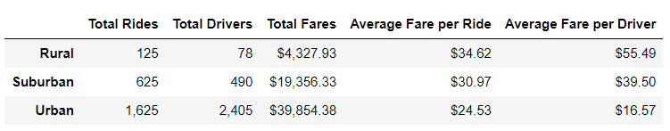

# PyBer Analysis

## Overview of the analysis

Following our initial analysis, we are given an additional assignment. Using our Python skills and knowledge of Pandas, we need to create a summary DataFrame of the ride-sharing data by city type. Then, using Pandas and Matplotlib, we will create a multiple-line graph that shows the total weekly fares for each city type. Once all these steps are completed, we will be able to see how the data differs by city type and how those differences can be used by decision-makers at PyBer.

## Results

Our first assignment was to create a summary Dataframe of the ride-sharing data provided initially by city type. We first had to make the following calculations:

- The total rides for each city type. 
- The total drivers for each city type. 
- The total amount of fares for each city type.
- The average fare per ride for each city type.
- The average fare per driver for each city type.

Once these calculations were completed, we were able to create the following Pyber summary DataFrame which combines the results:

From this summary, we are able to come to the following conclusions given the data provided:

- Urban cities have the highest amount of total rides, total drivers and total fares. On the other hand, they have the lowest average fare per driver and average fare per ride. 
- Suburban cities have the second highest amount of total rides, total drivers and total fares. While also having the second highest average fare per driver and average fare per ride.
- Rural cities have the lowest total rides, total drivers and total fares. On the other hand, they have the highest average fare per driver and average fare per ride.

Our second assignment was to create a multiple-line graph that shows the total fares for each week by city type. This was done using the following code after creating a weekly DataFrame of the date stamped records in 2019:

We were able to create the line graph below which clearly shows that throughout the first four months of 2019 Urban cities had a consistently higher total fares. Followed by Suburban cities and Rural cities respectively. 

All peaks happen the last week of February while the lowest happen the first or second week of January. 

## Summary

Overall, PyBer ridesharing services differ significantly in rural, suburban, and urban cities given the number of rides, drivers, and fares. The provided data supports that there is higher usage of PyBer ridesharing services in urban cities. There needs to be an improvement in rural cities which should be the focus moving forward. Increased activity in rural area could result in higher returns. We would recommend the CEO to provide incentives to drivers in rural cities in order to increase the amount of drivers available in this area. We would also recommend an increase in advertisement or marketing in those areas to let people know that this service is available in rural areas. Lastly, we would recommend incentives such as coupons for rural city consumers in order to increase the amount of rides in rural cities.
